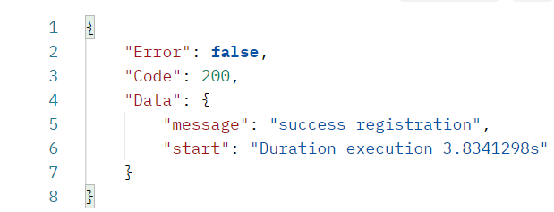
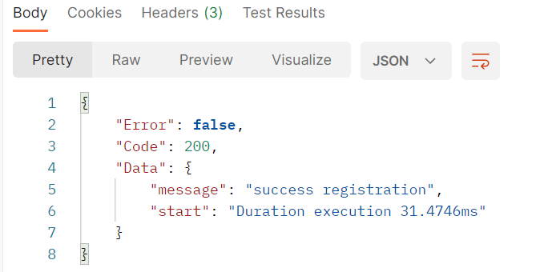

# Gorutine - optimize your app

## Deskription

this is a simple example of how to use goroutines to optimize your application.
in this case we create a simple app to register user, validation data from client, and send verification email to user. and you can see the process of sending an email to a user is taking a while. therefore we will use goroutines to cut the execution time of the process.

## result without use goroutine

this is result process registration and send email without use goroutine. you can see the process took 3.8s.
so we use goroutine for maximalize time process execution and you can see we shortened the time to 31 milliseconds. you can see the code in direktory service/user/impl/userServiceImpl.go:143

## using goroutine, channel, and context

if you see in service/user/impl/userServiceImpl.go line 81 you can see there's a method `helper.IsValid2`. the method use goroutine for validation request client in the background and send error through channel. and the service would catch error from channel then abort the signal via context to kill all validating goroutines.
